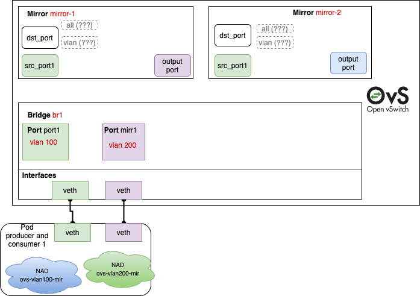
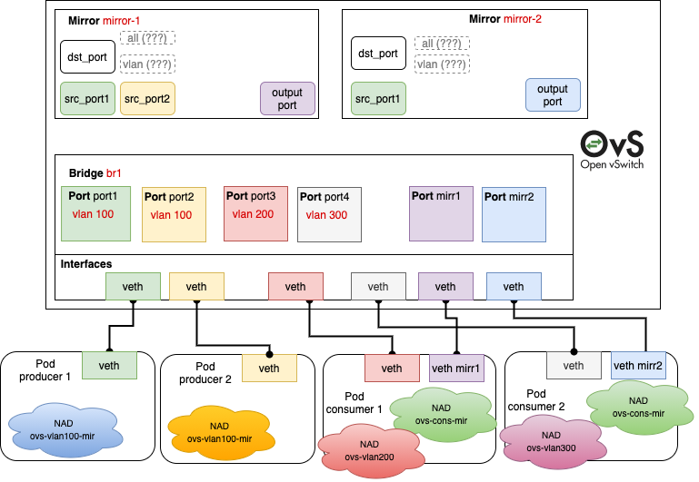
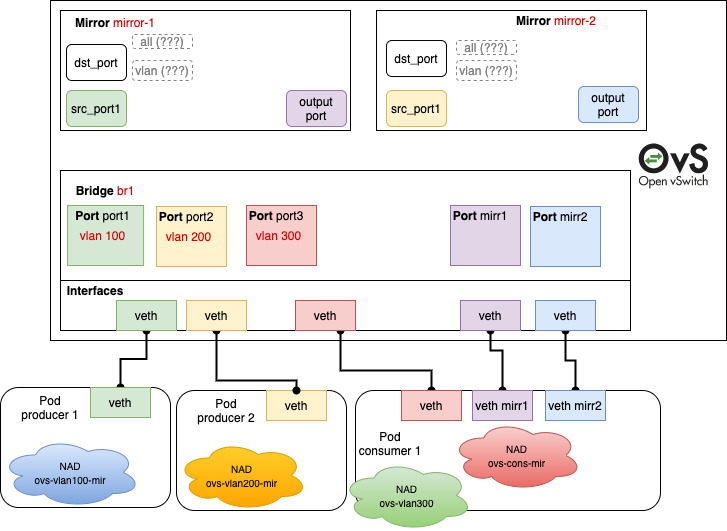

# Open vSwitch CNI Plugin - Traffic Mirroring Proposal

## Overview

This is a proposal for supporting the traffic mirroring feature of OVS into ovs-cni plugin.
The topic has been initially discussed in [issue 219](https://github.com/k8snetworkplumbingwg/ovs-cni/issues/219).

## Use case

Our project has the requirement of monitoring the network traffic via an IDS/IPS solution included within a dedicated pod. The standard approach is to have an OVS switch capable of mirroring the traffic of specific ports/VLANs into an output SPAN/RSPAN port.

## Goal

Create and manage multiple mirror ports through either ovs-cni or a dedicated cni-plugin in Network Configuration List (Multus) as defined in CNI spec 0.4.0.

## Requirements

- Create multiple mirror ports in a specific bridge
- Select sources (ports, VLAN)
- Select output port (SPAN) / output VLAN (RSPAN)

## API and test-cases

### Premises

1. In this proposal there are 2 approaches: “NAD” and “cni-args”, suggested in [issue 219](https://github.com/k8snetworkplumbingwg/ovs-cni/issues/219). For both of them, we considered three test cases. These are based on our requirements, but also on some tricky cases that should be considered before to implement the CNI plugin.
2. Both approaches rely first on the current `ovs` plugins to create the requested port via pod annotation. Afterwards, the output of the plugin execution is cascaded as input to the plugin that is responsible for managing the mirrors  (e.g. `ovs-mirror` plugin). This is possible thanks to [Multus chaining capability](https://github.com/containernetworking/cni/blob/spec-v0.4.0/SPEC.md#network-configuration-lists).
3. In the test-cases below we are considering `ovs-mirror` plugin as the only responsible plugin for the mirror management for both producers and consumers but, as detailed in the “Pros and Cons” paragraph at the end of the proposal, it is also reasonable to consider the implementation of two distinct plugins (`ovs-mirror-producer` and `ovs-mirror-consumer`).
4. In all diagrams below we used different colors to represent the logical relation between different entities. In case of OVS they are real DB relations, in case of Pods they represent network connections. Instead, NADs are represented with random colors without a real meaning.
5. In all diagrams below we focused on OVS Mirror `src_port` and `dst_port` to consider the representation with the finest granularity. In this way, we can specify single ports one by one. 
However, we are not expert in OVS and its database. In the official [DB Schema 7.10.1 PDF of Open vSwitch 2.3.90](http://www.openvswitch.org//ovs-vswitchd.conf.db.5.pdf) there is a detailed documentation about database relations and columns. Page 41 explains the *Mirror* table, but the *Selecting Packets for Mirroring* paragraph seems a little bit confusing. It’s not clear if `select_*` columns are mutually exclusive (like for outputs) or if there is any sort of priority. What happens if we set `select_all=true` with also a port in `select_src_port` and `select_dst_port`? The same applies for `select_vlan`.
Also, we have no experience in RSPAN ports (used in conjunction with `output_vlan`). In fact, we considered only `output_port` in all our examples.
6. We chose `selection` and `output` as JSON keys to refer to input and output ports for the mirror, and `mirrors` key to define the mirrors. However, these are only example keywords of this proposal. We should define better names with you and the rest of the community. For example, we can use specific keys like `producers` and `consumer`, instead of `mirrors`.

### **1. NAD approach**

In this approach the complexity is shifted toward the NAD configuration side.  The more the scenario is complex (e.g. a lot of vlans, multiple mirrors and different behaviour between pods) the more a greater number of NADs must be defined prior to the pods deployment (could become a little bit messy in complex cases).

**Producer NAD**

```json
{
    "type": "ovs-mirror",
    "bridge": BRIDGE_NAME,
    "mirrors": [
        {
            "name": MIRROR_NAME,
            "selection": SELECTION_ARRAY
        },
        (...)
    ]
}
```

`BRIDGE_NAME`: string that represents the unique name of the bridge in ovs database where the mirror should be added

`MIRROR_NAME`: string that represents the unique name of the mirror in ovs database

`SELECTION_ARRAY`: array of strings that represents the type of selections. Allowed values are:
- `src_port`
- `dst_port`
- `all`
- `vlan`

**Consumer NAD**

```json
{
    "type": "ovs-mirror",
    "bridge": BRIDGE_NAME,
    "mirrors": [
        {
            "name": MIRROR_NAME,
            "output": OUTPUT_TYPE
        }
    ]
}
```

`BRIDGE_NAME`: string that represents the unique name of the bridge in ovs database where the mirror should be added

`MIRROR_NAME`: string that represents the unique name of the mirror in ovs database

`OUTPUT_TYPE`: string that represents the type of the output port. Allowed values are:

- `port` (SPAN)
- `vlan` (RSPAN)

#### **Test case 1**


```yaml
# Produce to 2 mirrors and consume from 1
apiVersion: "k8s.cni.cncf.io/v1"
kind: NetworkAttachmentDefinition
metadata:
  name: ovs-vlan100-prod-mir1-prod-mir2
spec:
  config: |-
    {
        "cniVersion": "0.4.0",
        "plugins": [
            {
                "type": "ovs",
                "bridge": "br1",
                "vlan": 100
            },
            {
                "type": "ovs-mirror",
                "bridge": "br1",
                "mirrors": [
                    {
                        "name": "mirror-1",
                        "selection": ["src_port"]
                    },
                    {
                        "name": "mirror-2",
                        "selection": ["src_port"] 
                    }
                ]
            }
        ]
    }
---
apiVersion: "k8s.cni.cncf.io/v1"
kind: NetworkAttachmentDefinition
metadata:
  name: ovs-vlan200-cons-mir1
spec:
  config: |-
    {
        "cniVersion": "0.4.0",
        "plugins": [
            {
                "type": "ovs",
                "bridge": "br1",
                "vlan": 200
            },
            {
                "type": "ovs-mirror",
                "bridge": "br1",
                "mirrors": [
                    {
                        "name": "mirror-1",
                        "output": "port"
                    }
                ]
            }
        ]
    }
---
apiVersion: apps/v1
kind: Deployment
metadata:
  name: ovs-prod-cons
spec:
  template:
    metadata:
      annotations:
        k8s.v1.cni.cncf.io/networks: |-
          [
            {
              "name":"ovs-vlan100-prod-mir1-prod-mir2",
              "interface":"eth1",
              "namespace":"emu-cni"
            },
            {
              "name":"ovs-vlan200-cons-mir1",
              "interface":"eth2",
              "namespace":"emu-cni"
            }
          ]
```
#### **Test case 2**


```yaml
apiVersion: "k8s.cni.cncf.io/v1"
kind: NetworkAttachmentDefinition
metadata:
  name: ovs-vlan100-prod-mir-1-prod-mir-2
spec:
  config: |-
    {
        "cniVersion": "0.4.0",
        "plugins": [
            {
                "type": "ovs",
                "bridge": "br1",
                "vlan": 100
            },
            {
                "type": "ovs-mirror",
                "bridge": "br1",
                "mirrors": [
                    {
                        "name": "mirror-1",
                        "selection": ["src-port"]
                    },
                    {
                        "name": "mirror-2",
                        "selection": ["src-port"]
                    }
                ]
            }
        ]
    }
---
apiVersion: "k8s.cni.cncf.io/v1"
kind: NetworkAttachmentDefinition
metadata:
  name: ovs-vlan100-prod-mir-2
spec:
  config: |-
    {
        "cniVersion": "0.4.0",
        "plugins": [
            {
                "type": "ovs",
                "bridge": "br1",
                "vlan": 100
            },
            {
                "type": "ovs-mirror",
                "bridge": "br1",
                "mirrors": [
                    {
                        "name": "mirror-1",
                        "selection": ["src-port"]
                    }
                ]
            }
        ]
    }
---
apiVersion: "k8s.cni.cncf.io/v1"
kind: NetworkAttachmentDefinition
metadata:
  name: ovs-cons-mir-1
spec:
  config: |-
    {
        "cniVersion": "0.4.0",
        "plugins": [
            {
                "type": "ovs",
                "bridge": "br1"
            },
            {
                "type": "ovs-mirror",
                "bridge": "br1",
                "mirrors": [
                    {
                        "name": "mirror-1",
                        "output": "port"
                    }
                ]
            }
        ]
    }
---
apiVersion: "k8s.cni.cncf.io/v1"
kind: NetworkAttachmentDefinition
metadata:
  name: ovs-cons-mir-2
spec:
  config: |-
    {
        "cniVersion": "0.4.0",
        "plugins": [
            {
                "type": "ovs",
                "bridge": "br1"
            },
            {
                "type": "ovs-mirror",
                "bridge": "br1",
                "mirrors": [
                    {
                        "name": "mirror-2",
                        "output": "port"
                    }
                ]
            }
        ]
    }
---
apiVersion: "k8s.cni.cncf.io/v1"
kind: NetworkAttachmentDefinition
metadata:
  name: ovs-vlan200
spec:
  config: |-
    {
        "cniVersion": "0.4.0",
        "plugins": [
            {
                "type": "ovs",
                "bridge": "br1",
                "vlan": 200
            }
        ]
    }
---
apiVersion: "k8s.cni.cncf.io/v1"
kind: NetworkAttachmentDefinition
metadata:
  name: ovs-vlan300
spec:
  config: |-
    {
        "cniVersion": "0.4.0",
        "plugins": [
            {
                "type": "ovs",
                "bridge": "br1",
                "vlan": 300
            }
        ]
    }
---
apiVersion: apps/v1
kind: Deployment
metadata:
  name: ovs-producer-1-vlan100-mir1-mir2
spec:
  template:
    metadata:
      annotations:
        k8s.v1.cni.cncf.io/networks: |-
          [
            {
              "name":"ovs-vlan100-prod-mir-1-prod-mir-2",
              "interface":"eth1",
              "namespace":"emu-cni"
            }
          ]
---
apiVersion: apps/v1
kind: Deployment
metadata:
  name: ovs-producer-2-vlan100-mir1
spec:
  template:
    metadata:
      annotations:
        k8s.v1.cni.cncf.io/networks: |-
          [
            {
              "name":"ovs-vlan100-prod-mir-1",
              "interface":"eth1",
              "namespace":"emu-cni"
            }
          ]
---
apiVersion: apps/v1
kind: Deployment
metadata:
  name: ovs-consumer1-mir1
spec:
  template:
    metadata:
      annotations:
        k8s.v1.cni.cncf.io/networks: |-
          [
            {
              "name":"ovs-vlan200",
              "interface":"eth1",
              "namespace":"emu-cni"
            },
            {
              "name":"ovs-cons-mir-1",
              "interface":"eth2",
              "namespace":"emu-cni"
            }
          ]
---
apiVersion: apps/v1
kind: Deployment
metadata:
  name: ovs-consumer1-mir2
spec:
  template:
    metadata:
      annotations:
        k8s.v1.cni.cncf.io/networks: |-
          [
            {
              "name":"ovs-vlan300",
              "interface":"eth1",
              "namespace":"emu-cni"
            },
            {
              "name":"ovs-cons-mir-2",
              "interface":"eth2",
              "namespace":"emu-cni"
            }
          ]
```

#### **Test case 3**


```yaml
# Produce to 2 mirrors and consume from 1
apiVersion: "k8s.cni.cncf.io/v1"
kind: NetworkAttachmentDefinition
metadata:
  name: ovs-vlan100-prod-mir1
spec:
  config: |-
    {
       "cniVersion": "0.4.0",
        "plugins": [
            {
                "type": "ovs",
                "bridge": "br1",
                "vlan": 100
            },
            {
                "type": "ovs-mirror",
                "bridge": "br1",
                "mirrors": [
                    {
                        "name": "mirror-1",
                        "selection": ["src_port"] 
                    }
                ]
            }
        ]
    }
---
apiVersion: "k8s.cni.cncf.io/v1"
kind: NetworkAttachmentDefinition
metadata:
  name: ovs-vlan200-prod-mir2
spec:
  config: |-
    {
        "cniVersion": "0.4.0",
        "plugins": [
            {
                "type": "ovs",
                "bridge": "br1",
                "vlan": 200
            },
            {
                "type": "ovs-mirror",
                "bridge": "br1",
                "mirrors": [
                    {
                        "name": "mirror-2",
                        "selection": ["src_port"] 
                    }
                ]
            }
        ]
    }
---
apiVersion: "k8s.cni.cncf.io/v1"
kind: NetworkAttachmentDefinition
metadata:
  name: ovs-vlan300
spec:
  config: |-
    {
        "cniVersion": "0.4.0",
        "plugins": [
            {
                "type": "ovs",
                "bridge": "br1",
                "vlan": 300
            }
        ]
    }
---
apiVersion: "k8s.cni.cncf.io/v1"
kind: NetworkAttachmentDefinition
metadata:
  name: ovs-cons-mir1
spec:
  config: |-
    {
        "cniVersion": "0.4.0",
        "plugins": [
            {
                "type": "ovs",
                "bridge": "br1"
            },
            {
                "type": "ovs-mirror",
                "bridge": "br1",
                "mirrors": [
                    {
                        "name": "mirror-1",
                        "output": "port"
                    }
                ]
            }
        ]
    }
---
apiVersion: "k8s.cni.cncf.io/v1"
kind: NetworkAttachmentDefinition
metadata:
  name: ovs-cons-mir2
spec:
  config: |-
    {
        "cniVersion": "0.4.0",
        "plugins": [
            {
                "type": "ovs",
                "bridge": "br1"
            },
            {
                "type": "ovs-mirror",
                "bridge": "br1",
                "mirrors": [
                    {
                        "name": "mirror-2",
                        "output": "port"
                    }
                ]
            }
        ]
    }
---
apiVersion: apps/v1
kind: Deployment
metadata:
  name: ovs-prod-1
spec:
  template:
    metadata:
      annotations:
        k8s.v1.cni.cncf.io/networks: |-
          [
            {
              "name":"ovs-vlan100-prod-mir1",
              "interface":"eth1",
              "namespace":"emu-cni"
            }
          ]
---
apiVersion: apps/v1
kind: Deployment
metadata:
  name: ovs-prod-2
spec:
  template:
    metadata:
      annotations:
        k8s.v1.cni.cncf.io/networks: |-
          [
            {
              "name":"ovs-vlan200-prod-mir2",
              "interface":"eth1",
              "namespace":"emu-cni"
            }
          ]
---
apiVersion: apps/v1
kind: Deployment
metadata:
  name: ovs-cons
spec:
  template:
    metadata:
      annotations:
        k8s.v1.cni.cncf.io/networks: |-
          [
            {
              "name":"ovs-vlan300",
              "interface":"eth1",
              "namespace":"emu-cni"
            },
            {
              "name":"ovs-cons-mir1",
              "interface":"eth2",
              "namespace":"emu-cni"
            },
            {
              "name":"ovs-cons-mir2",
              "interface":"eth3",
              "namespace":"emu-cni"
            }
          ]
```
### **2. cni-args approach**

In this second approach the complexity is spread both among NADs and Pod annotations.  Even if the scenario is complex (e.g. a lot of vlans, multiple mirrors and different behaviour among pods) it doesn’t require to define a lot of NADs since the fine tuning is done through the pod annotation. In order to allow the pod to pass additional arguments to the cni-plugin we can take advantage of the [`cni-args` parameter that Multus expects](https://github.com/k8snetworkplumbingwg/multus-cni/blob/v3.8/pkg/types/types.go#L148) into the pod `networks` annotation.

#### **Test case 1**



```yaml
apiVersion: "k8s.cni.cncf.io/v1"
kind: NetworkAttachmentDefinition
metadata:
  name: ovs-vlan100-mir
spec:
  config: |-
    {
        "cniVersion": "0.4.0",
        "plugins": [
            {
                "type": "ovs",
                "bridge": "br1",
                "vlan": 100
            },
            {
                "type": "ovs-mirror",
                "bridge": "br1"
            }
        ]
    }
---
apiVersion: "k8s.cni.cncf.io/v1"
kind: NetworkAttachmentDefinition
metadata:
  name: ovs-vlan200-mir
spec:
  config: |-
    {
        "cniVersion": "0.4.0",
        "plugins": [
            {
                "type": "ovs",
                "bridge": "br1",
                "vlan": 200
            },
            {
                "type": "ovs-mirror",
                "bridge": "br1"
            }
        ]
    }
---
apiVersion: apps/v1
kind: Deployment
metadata:
  name: ovs-prod-1
spec:
  template:
    metadata:
      annotations:
        k8s.v1.cni.cncf.io/networks: |-
          [
            {
                "name":"ovs-vlan100-mir",
                "interface":"eth1",
                "namespace":"emu-cni",
                "cni-args": {
                    "mirrors": [
                        {
                            "name": "mirror-1",
                            "selection": ["src-port"]
                        },
                        {
                            "name": "mirror-2",
                            "selection": ["src-port"]
                        }
                    ]
                }
            },
            {
                "name":"ovs-vlan200-mir",
                "interface":"eth2",
                "namespace":"emu-cni",
                "cni-args": {
                    "mirrors": [
                        {
                            "name": "mirror-1",
                            "output": "port" 
                        }
                    ]
                }
            }
          ]
```

#### **Test case 2**



```yaml
apiVersion: "k8s.cni.cncf.io/v1"
kind: NetworkAttachmentDefinition
metadata:
  name: ovs-vlan100-mir
spec:
  config: |-
    {
        "cniVersion": "0.4.0",
        "plugins": [
            {
                "type": "ovs",
                "bridge": "br1",
                "vlan": 100
            },
            {
                "type": "ovs-mirror",
                "bridge": "br1"
            }
        ]
    }
---
apiVersion: "k8s.cni.cncf.io/v1"
kind: NetworkAttachmentDefinition
metadata:
  name: ovs-vlan200
spec:
  config: |-
    {
        "cniVersion": "0.4.0",
        "plugins": [
            {
                "type": "ovs",
                "bridge": "br1",
                "vlan": 200
            }
        ]
    }
---
apiVersion: "k8s.cni.cncf.io/v1"
kind: NetworkAttachmentDefinition
metadata:
  name: ovs-vlan300
spec:
  config: |-
    {
        "cniVersion": "0.4.0",
        "plugins": [
            {
                "type": "ovs",
                "bridge": "br1",
                "vlan": 300
            }
        ]
    }
---
apiVersion: "k8s.cni.cncf.io/v1"
kind: NetworkAttachmentDefinition
metadata:
  name: ovs-cons-mir
spec:
  config: |-
    {
        "cniVersion": "0.4.0",
        "plugins": [
            {
                "type": "ovs",
                "bridge": "br1"
            },
            {
                "type": "ovs-mirror",
                "bridge": "br1"
            }
        ]
    }
---
apiVersion: apps/v1
kind: Deployment
metadata:
  name: ovs-prod-1
spec:
  template:
    metadata:
      annotations:
        k8s.v1.cni.cncf.io/networks: |-
          [
            {
                "name":"ovs-vlan100-mir",
                "interface":"eth1",
                "namespace":"emu-cni",
                "cni-args": {
                    "mirrors": [
                        {
                            "name": "mirror-1",
                            "selection": ["src-port"]
                        },
                        {
                            "name": "mirror-2",
                            "selection": ["src-port"]
                        }
                    ]
                }
            }
          ]
---
apiVersion: apps/v1
kind: Deployment
metadata:
  name: ovs-prod-2
spec:
  template:
    metadata:
      annotations:
        k8s.v1.cni.cncf.io/networks: |-
          [
            {
                "name":"ovs-vlan100-mir",
                "interface":"eth1",
                "namespace":"emu-cni",
                "cni-args": {
                    "mirrors": [
                        {
                            "name": "mirror-1",
                            "selection": ["src-port"]
                        }
                    ]
                }
            }
          ]
---
apiVersion: apps/v1
kind: Deployment
metadata:
  name: ovs-cons-1
spec:
  template:
    metadata:
      annotations:
        k8s.v1.cni.cncf.io/networks: |-
          [
            {
                "name":"ovs-vlan200",
                "interface":"eth1",
                "namespace":"emu-cni"
            },
            {
                "name":"ovs-cons-mir",
                "interface":"eth2",
                "namespace":"emu-cni",
                "cni-args": {
                    "mirrors": [
                        {
                            "name": "mirror-1",
                            "output": "port"
                        }
                    ]
                }
            }
          ]
---
apiVersion: apps/v1
kind: Deployment
metadata:
  name: ovs-cons-2
spec:
  template:
    metadata:
      annotations:
        k8s.v1.cni.cncf.io/networks: |-
          [
            {
              "name":"ovs-vlan300",
              "interface":"eth1",
              "namespace":"emu-cni"
            },
            {
                "name":"ovs-cons-mir",
                "interface":"eth2",
                "namespace":"emu-cni",
                "cni-args": {
                    "mirrors": [
                        {
                            "name": "mirror-2",
                            "output": "port"
                        }
                    ]
                }
            }
          ]
```

#### **Test case 3**



```yaml
apiVersion: "k8s.cni.cncf.io/v1"
kind: NetworkAttachmentDefinition
metadata:
  name: ovs-vlan100-mir
spec:
  config: |-
    {
        "cniVersion": "0.4.0",
        "plugins": [
            {
                "type": "ovs",
                "bridge": "br1",
                "vlan": 100
            },
            {
                "type": "ovs-mirror",
                "bridge": "br1"
            }
        ]
    }
---
apiVersion: "k8s.cni.cncf.io/v1"
kind: NetworkAttachmentDefinition
metadata:
  name: ovs-vlan200-mir
spec:
  config: |-
    {
        "cniVersion": "0.4.0",
        "plugins": [
            {
                "type": "ovs",
                "bridge": "br1",
                "vlan": 200
            },
            {
                "type": "ovs-mirror",
                "bridge": "br1"
            }
        ]
    }
---
apiVersion: "k8s.cni.cncf.io/v1"
kind: NetworkAttachmentDefinition
metadata:
  name: ovs-vlan300
spec:
  config: |-
    {
        "cniVersion": "0.4.0",
        "plugins": [
            {
                "type": "ovs",
                "bridge": "br1",
                "vlan": 300
            }
        ]
    }
---
apiVersion: "k8s.cni.cncf.io/v1"
kind: NetworkAttachmentDefinition
metadata:
  name: ovs-cons-mir
spec:
  config: |-
    {
        "cniVersion": "0.4.0",
        "plugins": [
            {
                "type": "ovs",
                 "bridge": "br1"
            },
            {
                "type": "ovs-mirror",
                 "bridge": "br1"
            }
        ]
    }
---
apiVersion: apps/v1
kind: Deployment
metadata:
  name: ovs-prod-1
spec:
  template:
    metadata:
      annotations:
        k8s.v1.cni.cncf.io/networks: |-
          [
            {
                "name":"ovs-vlan100-mir",
                "interface":"eth1",
                "namespace":"emu-cni",
                "cni-args": {
                    "mirrors": [
                        {
                            "name": "mirror-1",
                            "selection": ["src-port"]
                        }
                    ]
                }
            }
          ]
---
apiVersion: apps/v1
kind: Deployment
metadata:
  name: ovs-prod-2
spec:
  template:
    metadata:
      annotations:
        k8s.v1.cni.cncf.io/networks: |-
          [
            {
                "name":"ovs-vlan200-mir",
                "interface":"eth1",
                "namespace":"emu-cni",
                "cni-args": {
                    "mirrors": [
                        {
                            "name": "mirror-2",
                            "selection": ["src-port"]
                        }
                    ]
                }
            }
          ]
---
apiVersion: apps/v1
kind: Deployment
metadata:
  name: ovs-cons-1
spec:
  template:
    metadata:
      annotations:
        k8s.v1.cni.cncf.io/networks: |-
          [
            {
                "name":"ovs-vlan300",
                "interface":"eth1",
                "namespace":"emu-cni"
            },
            {
                "name":"ovs-cons-mir",
                "interface":"eth2",
                "namespace":"emu-cni",
                "cni-args": {
                    "mirrors": [
                        {
                            "name": "mirror-1",
                            "output": "port"
                        }
                    ]
                }
            },
            {
                "name":"ovs-cons-mir",
                "interface":"eth3",
                "namespace":"emu-cni",
                "cni-args": {
                    "mirrors": [
                        {
                            "name": "mirror-2",
                            "output": "port"
                        }
                    ]
                }
            }
          ]
```

### Pros and Cons - NAD approach VS cni-args approach

NAD approach requires a NAD for every VLAN and, when multiple mirrors are present, if two pods on the same VLAN requires to produce to two different mirrors, you have to define two NADs with the same VLAN ID but different mirror configuration (ref. test-case 2. NAD approach vs cni-args approach). This will result in a high number of NADs (as you can see in the test-cases above).

Instead, in cni-args approach, you can pass mirror configuration via Deployment and use NADs only to define OVS ports and VLANs. Anyway, in most of the cases, pods in the same VLAN ID will produce to one set of mirrors. From a developer perspective, cni-args is much more flexible with respect to NAD approach. 

From an isolation point of view, NAD seems more secure: it limits the resources (the mirrors in this case) a pod can create/use. While with cni-args any pod may potentially request to produce/consume to/from any mirror without constraints. Although, we are not expert in kubernetes resources security/isolation, so the disadvantage we highlighted above may not be a real issue.

It's also possible to create 2 different plugins:

- `ovs-mirror-producer`: it only adds input ports (previously created by `ovs` plugin) into `select_*` columns of `Mirror` table
- `ovs-mirror-consumer`: it only adds the output into `output_port` and `output_vlan` columns of `Mirror` table

The advantage of having 2 different plugins is an easier input validation, in fact we can define specific JSON keys for a better developer experience. 
However, there will be many common functions (in particular to interact with `ovsdb`) that should be moved into a dedicated common package to reduce boiler-plate. One benefit is that you can restrict the user to interact either with `mirror-prod` or `mirror-cons` by declaring one or the other into the NAD.

## Implementation highlights

We studied a little bit the source code of `ovs-cni` to understand the general idea of how a CNI plugin should be written and how `ovs-cni` communicate with `ovsdb`.

We saw that inputs are parsed from json to a Go struct called `NetConf`. So, we should add additional params to this struct with the new `Mirrors` array in `types.go` :

```go
type NetConf struct {
	types.NetConf
	BrName  string    `json:"bridge,omitempty"`
	Mirrors []*Mirror `json:"mirrors"`
  (...)
}

type Mirror struct {
	Name      string   `json:"name"`
	Selection []string `json:"selection,omitempty"`
	Output    string   `json:"output,omitempty"`
}
```

Then we should define some utility functions in `ovsdb.go` to interact with `ovsdb`, in particular to select/insert/update/delete from `Mirror` table.

Before implementing this, it’s important to fully understand how `select_*` columns are managed by `ovsdb`, because, we don’t know if they have a sort of priority or if they are mutually exclusive.

From page 2 of [DB Schema 7.10.1 PDF of Open vSwitch 2.3.90](http://www.openvswitch.org//ovs-vswitchd.conf.db.5.pdf) there is the Table Relationship of `ovsdb`. As you can see a `Bridge` could have 0 or more `Mirrors` and every `Mirror`:

- 0 or 1 `Port` in `output_port` (`output_port?`)
- 0 or more `Ports` in `select_src_port` (`select_src_port*`)
- 0 or more `Ports` in `select_dst_port` (`select_dst_port*`)

but no details about using more `select_*` at the same time.

```go
portUUIDStr := fmt.Sprintf("Mir%s", intfName)
portUUID := ovsdb.UUID{GoUUID: portUUIDStr}

mirror := make(map[string]interface{})
mirror["name"] = mirrorName
mirror["select_all"] = // boolean true/false
mirror["select_dst_port"] = // Set of Ports
mirror["select_src_port"] = // Set of Ports
mirror["select_vlan"] = // Set of integers
mirror["output_port"] = selectPortUUID
// mirror["output_vlan"] = ???

oMap, err := ovsdb.NewOvsMap(map[string]string{
	"contNetns": contNetnsPath,
	"contIface": contIfaceName,
	"owner":     ovsPortOwner,
})
mirror["external_ids"] = oMap

// Add an entry in Mirror table
mirrorOp := ovsdb.Operation{
	Op:       "insert",
	Table:    "Mirror",
	Row:      mirror,
	UUIDName: portUUIDStr,
}
```

We also need to add the `Mirror` row to the `Bridge` in this way:

```go
mutateSet, _ := ovsdb.NewOvsSet(mirrorPortUUID)
mutation := ovsdb.NewMutation("mirrors", ovsdb.MutateOperationInsert, mutateSet)
condition := ovsdb.NewCondition("name", ovsdb.ConditionEqual, bridgeName)
mutateOp := ovsdb.Operation{
	Op:        "mutate",
	Table:     "Bridge",
	Mutations: []ovsdb.Mutation{*mutation},
	Where:     []ovsdb.Condition{condition},
}
```

Obviously, we have to add functions and utilities to implement `cmdDel` and `cmdCheck`. What we discussed here is only a general idea.

In case of a dedicated plugin called `ovs-mirror`, we need to parse results from the previous plugin `ovs` (defined in the plugins array), because CNI specs 0.4.0 says that previous plugins adds results in a `prevResult` json object. So, `ovs-mirror` will receive as json input (StdinData) something like this:

```json
{
    "cniVersion": "0.4.0"
	"type":"ovs-mirror"
	"name": "mirror-1",
	"bridge": "br0",
	"args": {
        "cni": {
            "mirrors": [
                {
                    "name": "mirror-1",
                    "output": "port"
                }
            ]
        }
    },
    "prevResult": {
        "cniVersion": "0.4.0", 
        "interfaces": [
            {
                "name":"veth83a30e96",
                "mac":"b2:36:b0:4f:e1:b5"
            },
            {
                "name":"eth1",
                "mac":"7a:65:b5:f7:2a:89",
                "sandbox":"/var/run/netns/cni-d79b657b-b118-9c8c-7bff-4cb58c36fdd2"
            }
        ],
        "dns":{}
    }
}
```

## Questions

- Who is responsible for the mirror creation?
    - both producer and consumer could operate in INSERT OR UPDATE mode
- Who is responsible for the mirror deletion?
- How does OVSDB handles concurrency? E.g. a producer and a consumer (or 2 producers) try to insert the same row in the `Mirrors` table at the same time
- Are `select_*` columns in `Mirror` table of OVS mutually exclusive or not? If not, is there a specific priority? [http://www.openvswitch.org//ovs-vswitchd.conf.db.5.pdf](http://www.openvswitch.org//ovs-vswitchd.conf.db.5.pdf) (page 41)
- Which is the best approach to define `mirrors`?
    - A single key called `mirrors` with a similar syntax for both producer and consumer
        
        ```json
        # Producer NAD. List is needed only to produce
        "mirrors": [
            {
                "name": "mirror-1",
                "selection": ["src-port"]
            },
            {
                "name": "mirror-2",
                "selection": ["src-port", "dst-port"]
            }
        ]
        
        # Consumer NAD
        "mirrors": [
            {
                "name": "mirror-1",
                "output": "port"
            }
        ]
        ```
        
        Not valid cases:
        
        ```json
        
        # NAD cannot set one port both as a input and as an output at the same time
        "mirrors": [
            {
                "name": "mirror-1",
                "selection": ["src-port", "dst-port"],
                "output": "port"
            }
        ]
        # or
        "mirrors": [
            {
                "name": "mirror-1",
                "selection": ["src-port", "dst-port"]
            },
            {
                "name": "mirror-2",
                "output": "port"
            }
        ]
        
        # NAD cannot set same port as output for two different mirrors: pod must request two distintic interfaces related to two NADs pointing to two different mirrors
        "mirrors": [
            {
                "name": "mirror-1",
                "output": "port"
            },
            {
                "name": "mirror-2",
                "output": "port"
            }
        ]
        ```
        
    - 2 keys: `producers`  and `consumer` (singular, not an array)
        
        ```json
        # Producer NAD
        "producers": [
        	{
                "name": "mirror-1",
                "selection": ["src-port"]
            },
            {
                "name": "mirror-2",
                "selection": ["src-port", "dst-port"]
            }
        ]
        
        # Consumer NAD
        "consumer": {
            "name": "mirror-1",
            "output": "port"
        }
        
        # Not valid cases
        # when 'producers' and 'consumer' are both defined --> must be mutually exclusive
        ```
