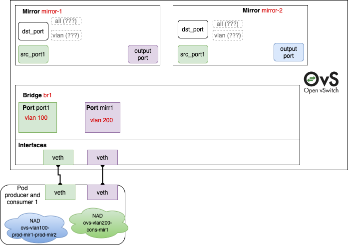
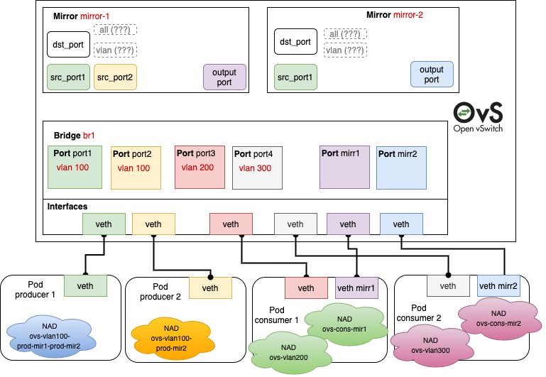
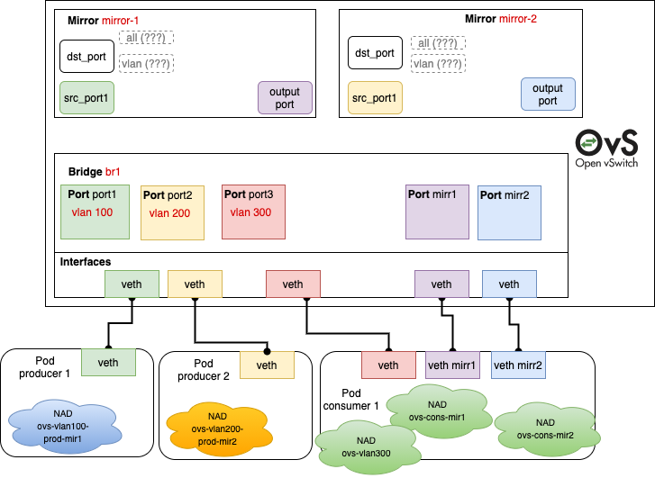

# Open vSwitch CNI Plugin - Traffic Mirroring

## Overview

This is the documentation of ovs-cni plugin to support the OVS traffic mirroring feature.
The topic has been initially discussed in [issue 219](https://github.com/k8snetworkplumbingwg/ovs-cni/issues/219).

The main idea is creating and managing multiple mirror ports (SPAN) through ovs-cni in Network Configuration List (Multus) as defined in CNI spec.

## Supported features

- Create multiple mirror ports in a specific bridge
- Select source ports
- Select output port (SPAN)

**RSPAN mirrors are not supported**

## API and test-cases

### Premises

1. The approach relies first on the current `ovs` plugins to create the requested port via pod annotation. Afterwards, the output of the plugin execution is cascaded as input to the plugin that is responsible for managing the mirrors  (e.g. `ovs-mirror-producer` and `ovs-mirror-consumer` plugins). This is possible thanks to [Multus chaining capability](https://github.com/containernetworking/cni/blob/spec-v0.4.0/SPEC.md#network-configuration-lists).
2. In all diagrams below we used different colors to represent the logical relation between different entities. In case of OVS they are real DB relations, in case of Pods they represent network connections. Instead, NADs are represented with random colors without a real meaning.
3. In all diagrams below we focused on OVS Mirror `src_port` and `dst_port` to consider the representation with the finest granularity. In this way, we can specify single ports one by one.
For simplicity, we ignore `output_vlan` (used for RSPAN) as mirror output.


### Examples

**Producer NAD**

```json
{
    "type": "ovs-mirror-producer",
    "bridge": BRIDGE_NAME,
    "mirrors": [
        {
            "name": MIRROR_NAME,
            "ingress": INGRESS_ENABLED,
            "egress": EGRESS_ENABLED
        },
        (...)
    ]
}
```

`BRIDGE_NAME`: string that represents the unique name of the bridge in ovs database where the mirror should be added

`MIRROR_NAME`: string that represents the unique name of the mirror in ovs database

`INGRESS_ENABLED`: if true it enables ovs mirror src_port

`EGRESS_ENABLED`: if true it enables ovs mirror dst_port


**Consumer NAD**

```json
{
    "type": "ovs-mirror-consumer",
    "bridge": BRIDGE_NAME,
    "mirrors": [
        {
            "name": MIRROR_NAME
        }
    ]
}
```

`BRIDGE_NAME`: string that represents the unique name of the bridge in ovs database where the mirror should be added

`MIRROR_NAME`: string that represents the unique name of the mirror in ovs database


#### Test case 1



```yaml
# Produce to 2 mirrors and consume from 1
apiVersion: "k8s.cni.cncf.io/v1"
kind: NetworkAttachmentDefinition
metadata:
  name: ovs-vlan100-prod-mir1-prod-mir2
spec:
  config: |-
    {
        "cniVersion": "0.4.0",
        "plugins": [
            {
                "type": "ovs",
                "bridge": "br1",
                "vlan": 100
            },
            {
                "type": "ovs-mirror-producer",
                "bridge": "br1",
                "mirrors": [
                    {
                        "name": "mirror-1",
                        "ingress": true,
                        "egress": true
                    },
                    {
                        "name": "mirror-2",
                        "ingress": true,
                        "egress": true
                    }
                ]
            }
        ]
    }
---
apiVersion: "k8s.cni.cncf.io/v1"
kind: NetworkAttachmentDefinition
metadata:
  name: ovs-vlan200-cons-mir1
spec:
  config: |-
    {
        "cniVersion": "0.4.0",
        "plugins": [
            {
                "type": "ovs",
                "bridge": "br1"
            },
            {
                "type": "ovs-mirror-consumer",
                "bridge": "br1",
                "mirrors": [
                    {
                        "name": "mirror-1"
                    }
                ]
            }
        ]
    }
---
apiVersion: apps/v1
kind: Deployment
metadata:
  name: ovs-prod-cons
spec:
  template:
    metadata:
      annotations:
        k8s.v1.cni.cncf.io/networks: |-
          [
            {
              "name":"ovs-vlan100-prod-mir1-prod-mir2",
              "interface":"eth1",
              "namespace":"emu-cni"
            },
            {
              "name":"ovs-vlan200-cons-mir1",
              "interface":"eth2",
              "namespace":"emu-cni"
            }
          ]
```
#### Test case 2



```yaml
apiVersion: "k8s.cni.cncf.io/v1"
kind: NetworkAttachmentDefinition
metadata:
  name: ovs-vlan100-prod-mir-1-prod-mir-2
spec:
  config: |-
    {
        "cniVersion": "0.4.0",
        "plugins": [
            {
                "type": "ovs",
                "bridge": "br1",
                "vlan": 100
            },
            {
                "type": "ovs-mirror-producer",
                "bridge": "br1",
                "mirrors": [
                    {
                        "name": "mirror-1",
                        "ingress": true,
                        "egress": true
                    },
                    {
                        "name": "mirror-2",
                        "ingress": true,
                        "egress": true
                    }
                ]
            }
        ]
    }
---
apiVersion: "k8s.cni.cncf.io/v1"
kind: NetworkAttachmentDefinition
metadata:
  name: ovs-vlan100-prod-mir-2
spec:
  config: |-
    {
        "cniVersion": "0.4.0",
        "plugins": [
            {
                "type": "ovs",
                "bridge": "br1",
                "vlan": 100
            },
            {
                "type": "ovs-mirror-producer",
                "bridge": "br1",
                "mirrors": [
                    {
                        "name": "mirror-1",
                        "ingress": true,
                        "egress": true
                    }
                ]
            }
        ]
    }
---
apiVersion: "k8s.cni.cncf.io/v1"
kind: NetworkAttachmentDefinition
metadata:
  name: ovs-cons-mir-1
spec:
  config: |-
    {
        "cniVersion": "0.4.0",
        "plugins": [
            {
                "type": "ovs",
                "bridge": "br1"
            },
            {
                "type": "ovs-mirror-consumer",
                "bridge": "br1",
                "mirrors": [
                    {
                        "name": "mirror-1"
                    }
                ]
            }
        ]
    }
---
apiVersion: "k8s.cni.cncf.io/v1"
kind: NetworkAttachmentDefinition
metadata:
  name: ovs-cons-mir-2
spec:
  config: |-
    {
        "cniVersion": "0.4.0",
        "plugins": [
            {
                "type": "ovs",
                "bridge": "br1"
            },
            {
                "type": "ovs-mirror-consumer",
                "bridge": "br1",
                "mirrors": [
                    {
                        "name": "mirror-2"
                    }
                ]
            }
        ]
    }
---
apiVersion: "k8s.cni.cncf.io/v1"
kind: NetworkAttachmentDefinition
metadata:
  name: ovs-vlan200
spec:
  config: |-
    {
        "cniVersion": "0.4.0",
        "plugins": [
            {
                "type": "ovs",
                "bridge": "br1",
                "vlan": 200
            }
        ]
    }
---
apiVersion: "k8s.cni.cncf.io/v1"
kind: NetworkAttachmentDefinition
metadata:
  name: ovs-vlan300
spec:
  config: |-
    {
        "cniVersion": "0.4.0",
        "plugins": [
            {
                "type": "ovs",
                "bridge": "br1",
                "vlan": 300
            }
        ]
    }
---
apiVersion: apps/v1
kind: Deployment
metadata:
  name: ovs-producer-1-vlan100-mir1-mir2
spec:
  template:
    metadata:
      annotations:
        k8s.v1.cni.cncf.io/networks: |-
          [
            {
              "name":"ovs-vlan100-prod-mir-1-prod-mir-2",
              "interface":"eth1",
              "namespace":"emu-cni"
            }
          ]
---
apiVersion: apps/v1
kind: Deployment
metadata:
  name: ovs-producer-2-vlan100-mir1
spec:
  template:
    metadata:
      annotations:
        k8s.v1.cni.cncf.io/networks: |-
          [
            {
              "name":"ovs-vlan100-prod-mir-1",
              "interface":"eth1",
              "namespace":"emu-cni"
            }
          ]
---
apiVersion: apps/v1
kind: Deployment
metadata:
  name: ovs-consumer1-mir1
spec:
  template:
    metadata:
      annotations:
        k8s.v1.cni.cncf.io/networks: |-
          [
            {
              "name":"ovs-vlan200",
              "interface":"eth1",
              "namespace":"emu-cni"
            },
            {
              "name":"ovs-cons-mir-1",
              "interface":"eth2",
              "namespace":"emu-cni"
            }
          ]
---
apiVersion: apps/v1
kind: Deployment
metadata:
  name: ovs-consumer1-mir2
spec:
  template:
    metadata:
      annotations:
        k8s.v1.cni.cncf.io/networks: |-
          [
            {
              "name":"ovs-vlan300",
              "interface":"eth1",
              "namespace":"emu-cni"
            },
            {
              "name":"ovs-cons-mir-2",
              "interface":"eth2",
              "namespace":"emu-cni"
            }
          ]
```

#### Test case 3



```yaml
# Produce to 2 mirrors and consume from 1
apiVersion: "k8s.cni.cncf.io/v1"
kind: NetworkAttachmentDefinition
metadata:
  name: ovs-vlan100-prod-mir1
spec:
  config: |-
    {
       "cniVersion": "0.4.0",
        "plugins": [
            {
                "type": "ovs",
                "bridge": "br1",
                "vlan": 100
            },
            {
                "type": "ovs-mirror-producer",
                "bridge": "br1",
                "mirrors": [
                    {
                        "name": "mirror-1",
                        "ingress": true,
                        "egress": true
                    }
                ]
            }
        ]
    }
---
apiVersion: "k8s.cni.cncf.io/v1"
kind: NetworkAttachmentDefinition
metadata:
  name: ovs-vlan200-prod-mir2
spec:
  config: |-
    {
        "cniVersion": "0.4.0",
        "plugins": [
            {
                "type": "ovs",
                "bridge": "br1",
                "vlan": 200
            },
            {
                "type": "ovs-mirror-producer",
                "bridge": "br1",
                "mirrors": [
                    {
                        "name": "mirror-2",
                        "ingress": true,
                        "egress": true
                    }
                ]
            }
        ]
    }
---
apiVersion: "k8s.cni.cncf.io/v1"
kind: NetworkAttachmentDefinition
metadata:
  name: ovs-vlan300
spec:
  config: |-
    {
        "cniVersion": "0.4.0",
        "plugins": [
            {
                "type": "ovs",
                "bridge": "br1",
                "vlan": 300
            }
        ]
    }
---
apiVersion: "k8s.cni.cncf.io/v1"
kind: NetworkAttachmentDefinition
metadata:
  name: ovs-cons-mir1
spec:
  config: |-
    {
        "cniVersion": "0.4.0",
        "plugins": [
            {
                "type": "ovs",
                "bridge": "br1"
            },
            {
                "type": "ovs-mirror-consumer",
                "bridge": "br1",
                "mirrors": [
                    {
                        "name": "mirror-1"
                    }
                ]
            }
        ]
    }
---
apiVersion: "k8s.cni.cncf.io/v1"
kind: NetworkAttachmentDefinition
metadata:
  name: ovs-cons-mir2
spec:
  config: |-
    {
        "cniVersion": "0.4.0",
        "plugins": [
            {
                "type": "ovs",
                "bridge": "br1"
            },
            {
                "type": "ovs-mirror-consumer",
                "bridge": "br1",
                "mirrors": [
                    {
                        "name": "mirror-2"
                    }
                ]
            }
        ]
    }
---
apiVersion: apps/v1
kind: Deployment
metadata:
  name: ovs-prod-1
spec:
  template:
    metadata:
      annotations:
        k8s.v1.cni.cncf.io/networks: |-
          [
            {
              "name":"ovs-vlan100-prod-mir1",
              "interface":"eth1",
              "namespace":"emu-cni"
            }
          ]
---
apiVersion: apps/v1
kind: Deployment
metadata:
  name: ovs-prod-2
spec:
  template:
    metadata:
      annotations:
        k8s.v1.cni.cncf.io/networks: |-
          [
            {
              "name":"ovs-vlan200-prod-mir2",
              "interface":"eth1",
              "namespace":"emu-cni"
            }
          ]
---
apiVersion: apps/v1
kind: Deployment
metadata:
  name: ovs-cons
spec:
  template:
    metadata:
      annotations:
        k8s.v1.cni.cncf.io/networks: |-
          [
            {
              "name":"ovs-vlan300",
              "interface":"eth1",
              "namespace":"emu-cni"
            },
            {
              "name":"ovs-cons-mir1",
              "interface":"eth2",
              "namespace":"emu-cni"
            },
            {
              "name":"ovs-cons-mir2",
              "interface":"eth3",
              "namespace":"emu-cni"
            }
          ]
```